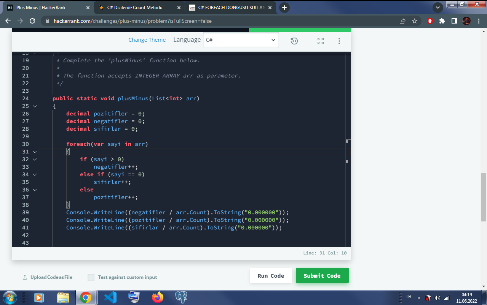

# HackerRankPlusMinus
[Kodluyoruz](https://app.patika.dev/) .Net eğitimi için hazırlanan C# Tanımlama, Erişim ve Döngülerle Dizi Kullanımı ödevidir. HackerRank Plus Minus sorusunun cevabı için oluşturulmuştur.
## Hacker Rank Plus Minus

- Öncelikle decimal türünde nesneler oluşturulmuştur.
- arr dizisindeki sayi değerleri için foreach döngüsü oluşturulmuştur.
- for each döngüsünün içinde for döngüsü tanımlanmıştır. Pozitif, negatif ve sıfır nesneleri birer artacak şekilde oluşturulmuştur.
- arr dizisi Count metodu ile saydırılmış ve nesne türüne göre bölünmüştür. ToString ile noktadan sonraki 6 hanenin yazdırılması sağlanmıştır.
    ``` 
        decimal pozitifler = 0;
        decimal negatifler = 0;
        decimal sifirlar = 0;
        
        foreach(var sayi in arr)
        {
            if (sayi > 0)
                negatifler++;
            else if (sayi == 0)
                sifirlar++;
            else 
                pozitifler++;
        }
        Console.WriteLine((negatifler / arr.Count).ToString("0.000000"));
        Console.WriteLine((pozitifler / arr.Count).ToString("0.000000"));
        Console.WriteLine((sifirlar / arr.Count).ToString("0.000000"));
    
    ```

- Görsel;
    
### [Hacker Rank Profilim](https://www.hackerrank.com/ogulcan_celik24) 
#### https://www.hackerrank.com/ogulcan_celik24
#### www.patika.dev